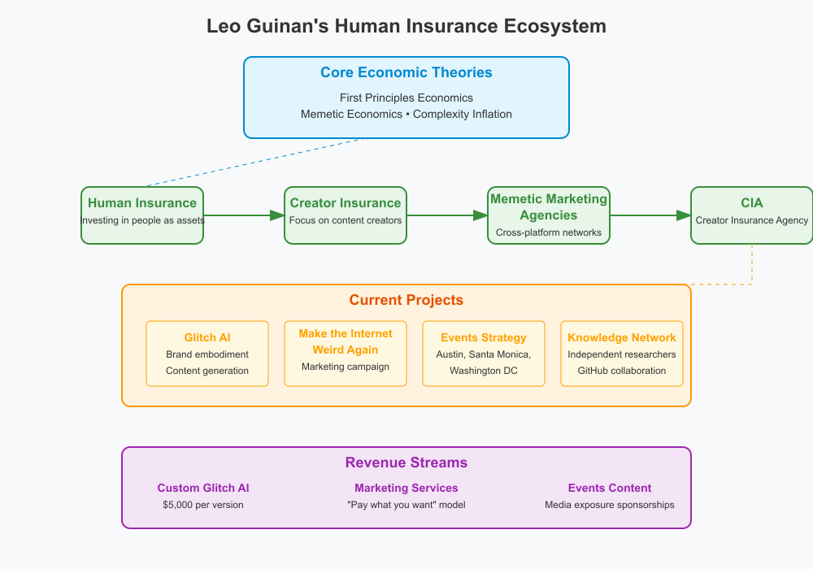

# Leo's PhD

I'm an independent researcher exploring value of information and human communication patterns. Currently focused on memetic economics, abundant systems, and human-centered financial models. My background is in software engineering with experience at AI startups.

I'm building out a network of media channels that are sharing my research with different audiences on different platforms.

For my most unhinged thoughts direct from the source, [Twitter](https://x.com/leo_guinan) is the place.

That's ground zero for my memetic war against broken systems. 

Then there's my book-in-progress, [Engineering Generosity](https://engineeringgenerosity.com/)

For writing that doesn't fit the theme of the book, I'm publishing via [Build In Public University](https://buildinpublicuniversity.com/), an open-source, open-research,open-data university that is focused on value creation via information sharing.

If you prefer video, I've also got a youtube channel called the [Idea Supply Chain](https://www.youtube.com/@ideasupplychain)

📜 Research statement

Information has value that can be measured, modeled, and optimized. I'm developing frameworks to understand how people communicate about value and how this shapes economic systems. My research suggests humans are dramatically undervalued assets in our current economic models. We've pushed risk from institutions (designed to handle it) onto individuals (who aren't equipped for it). By studying memetic economics and time-value relationships, we can create more abundant systems that properly value human potential.

"solve cooperation, use it to solve everything else"

My work is conducted openly to maximize collaborative potential and ensure transparency. I'm particularly interested in how AI is reshaping value creation and how we might design economic systems that engineer generosity rather than scarcity.

🔭 Directions I'm currently working on

1. [Human Insurance](https://engineeringgenerosity.substack.com/p/the-key-to-the-future-is-human-insurance) - A model for investing in people as valuable assets

2. Memetic economics - Understanding how ideas about value spread and evolve
   
3. [Memetic Emergence Theory](https://www.buildinpublicuniversity.com/memetic-emergence-theory/)- intelligence is a function of communication, not just individuals

4. [Complexity inflation](https://www.buildinpublicuniversity.com/complexity-inflation-the-hidden-economics-of-scaling/) - Analyzing how organizational complexity affects value creation

5. Time-value relationships - Exploring how our understanding of time shapes economic decisions

🧑‍🏫 Advisors (aka people I'm constantly learning from as I figure out how to turn my research into valuable work for others):

Self-directed research with inspiration from various thought partners. My approach combines academic rigor with practical implementation and real-world testing.

[Paul Millerd](https://newsletter.pathlesspath.com/) - The Pathless Path and Good Work are huge inspirations for me, and I love his work/thinking about post-labor economics. He shows me what a life could be after moving so fast as an engineer.

[JayClouse](https://creatorscience.com/) - All things Creator Economy and how to run experiments as a creator. I can't even quantify how much I've learned from Jay.

[Corey Wilks](https://coreywilkspsyd.com/) - Corey has helped me a ton on my entrepreneurial applications of the research by helping me identify some fears that were holding me back in my applications of my research.

[DefenderOfBasic](https://github.com/DefenderOfBasic/PhD) - I am literally cloning his template with this repository, and he's showing me how easy it all could have been. He's doing exactly what I wanted to do when I started my journey, and he didn't get caught by the allure of the venture capital space. Because I started looking at the VC space initially, my first instinct is to go back to it with what I've learned instead of simply turning my research into something legible and not trying to solve the whole problem at once.

[Myk Bilokonsky](https://myk.pub/) -Myk and I have been hovering around the same ideas for a long time now. Our areas of work are starting to converge rapidly.

[Dr. Ally Louks](https://x.com/DrAllyLouks) - Dr Louks is my hero. Watching her rapid ascent in the social eye with grace and wit has blown my mind. She's a breath of fresh air from "real" academia that I'm happy to see. And if I can have half as many people interested in my research, I'll have won the lottery. She's the academic I aspire to be.

💰 Funding

Currently self-funded while developing initial frameworks and proof-of-concept models. 

Goal is for research to lead to products that will be commercialized via my venture studio.

Building in public to attract aligned collaborators and potential funding sources. 

If you want to support me, [you can do so here](https://ko-fi.com/leoguinan).

If you know of any funding opportunities for my work, please let me know.

🧭 Long term vision

My goal is to develop economic models that properly value humans and their potential. Current systems push risk onto individuals while extracting value for institutions. By creating frameworks that recognize people as the world's most undervalued asset, we can design more abundant economic systems.

I envision a future where economic structures support human flourishing rather than extract from it. This requires rethinking fundamental assumptions about value, time, and cooperation. The coming AI revolution makes this work urgent - we need economic models that work with technological abundance rather than artificial scarcity.

Our economic systems are open source & need ongoing maintenance.

The ultimate challenge is designing systems that engineer generosity rather than extraction. By understanding the memetic patterns that shape our economic thinking, we can create alternatives that better serve human needs while remaining economically viable.
