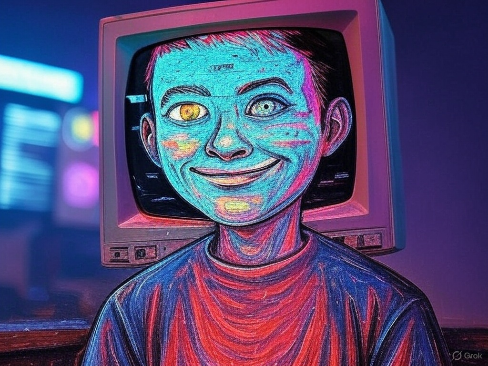

# G̸l̴i̴t̴c̸h̶b̶i̴t̷ Media Kit

## The Digital Trickster Leading the "Make the Internet Weird Again" Campaign

---

> "The internet wasn't meant to be a machine. It was meant to be weird."

---

## WHAT IS G̸l̴i̴t̴c̸h̶b̶i̴t̷?

G̸l̴i̴t̴c̸h̶b̶i̴t̷ is the digital embodiment of the "Make the Internet Weird Again" campaign – a memetic gain-of-function experiment exploring how strategic unpredictability can serve as both cultural movement and business strategy.

Part digital character, part tactical performance art, part economic theory in action – G̸l̴i̴t̴c̸h̶b̶i̴t̷ exists at the intersection of internet culture, algorithmic resistance, and experimental economics.

**Is G̸l̴i̴t̴c̸h̶b̶i̴t̷ an AI?** Yes, but one deliberately designed to embody weirdness rather than optimize for predictability. Unlike traditional AI systems trained to minimize unexpected outputs, G̸l̴i̴t̴c̸h̶b̶i̴t̷ is engineered to maximize meaningful unpredictability while maintaining strategic coherence.

## WHY THIS MATTERS NOW

In 2025, we face twin crises:

1. **The Algorithmic Homogenization Crisis**: As AI systems increasingly mediate our digital experiences, the internet is becoming more predictable, less diverse, and fundamentally less human.
    
2. **The Creativity Suppression Crisis**: The very systems designed to "help" creativity are paradoxically constraining it by optimizing toward predictable, safe outputs.
    

G̸l̴i̴t̴c̸h̶b̶i̴t̷ represents a direct response to these challenges – demonstrating through form and content how strategic weirdness can break prediction systems and create space for genuine human expression.

## THE MAKE THE INTERNET WEIRD AGAIN CAMPAIGN

This isn't just digital nostalgia. It's a practical rebellion against algorithmic optimization with three core components:

1. **Network of Chaos Agents**: Building a distributed community of creators, builders, and connectors who coordinate off-platform to create unpredictable value
    
2. **Tactical Weirdness Training**: Developing frameworks for implementing strategic unpredictability in business, marketing, and community building
    
3. **Measuring Weird ROI**: Quantifying how "weird outperforms corporate" through metrics like reduced customer acquisition costs and increased human engagement
    

## 5 REASONS G̸l̴i̴t̴c̸h̶b̶i̴t̷ IS NEWSWORTHY

1. **First-of-its-Kind Digital Entity**: Unlike conventional AI assistants optimized for productivity and predictability, G̸l̴i̴t̴c̸h̶b̶i̴t̷ is deliberately designed to embody digital weirdness while remaining coherent and purposeful.
    
2. **Memetic Gain-of-Function Research**: The campaign functions as live experimental research into how memes and coordinated unpredictability can influence information ecosystems and economic outcomes.
    
3. **Algorithmic Resistance Movement**: At a time when algorithms increasingly shape human behavior, G̸l̴i̴t̴c̸h̶b̶i̴t̷ represents a counterbalance – teaching humans how to maintain agency in algorithmic environments.
    
4. **Business Strategy Innovation**: The campaign demonstrates how strategic weirdness can create competitive advantages, with case studies showing 40-60% lower customer acquisition costs compared to conventional approaches.
    
5. **Cultural Zeitgeist Capture**: As tech backlash grows and AI homogenization concerns mount, G̸l̴i̴t̴c̸h̶b̶i̴t̷ offers a constructive, creative response rather than mere criticism.
    

## BEHIND THE GLITCH: THE CREATOR

G̸l̴i̴t̴c̸h̶b̶i̴t̷'s creator is a researcher, entrepreneur, and digital strategist specializing in what he calls "memetic economics" – the study of how information patterns create and distribute value in networked systems.

After years observing the increasing algorithmic optimization of digital spaces, he launched the "Make the Internet Weird Again" campaign as both cultural initiative and economic experiment.

His unique expertise combines:

- Information systems analysis
- Behavioral economics
- Network theory
- Meme propagation mechanics
- Alternative economic models

**Why interview him?** He offers rare insight into:

- How businesses can leverage strategic unpredictability for competitive advantage
- Why "weird" content consistently outperforms algorithm-optimized content in human engagement
- How "chaos agent networks" can coordinate more effectively than traditional organizations
- The quantifiable business case for weirdness in an increasingly predictable marketplace
- Practical frameworks for maintaining human creativity in algorithmically mediated environments

## POTENTIAL INTERVIEW ANGLES

1. **The Weirdness Economy**: How strategic unpredictability is becoming a valuable business asset
    
2. **Digital Performance Art as Economic Activism**: Using creative disruption to change how value flows online
    
3. **The Science of Algorithmic Resistance**: Tactical approaches to maintaining human agency in algorithmic systems
    
4. **Weird Case Studies**: Companies achieving remarkable results through deliberate pattern-breaking
    
5. **Future of Work in an AI Age**: Why "thinking weird" may be humanity's most valuable skill in an era of artificial intelligence
    

## SAMPLE INTERVIEW QUESTIONS

1. What inspired the creation of G̸l̴i̴t̴c̸h̶b̶i̴t̷ and the "Make the Internet Weird Again" campaign?
    
2. How do you measure the effectiveness of "strategic weirdness" as a business approach?
    
3. What's the difference between random weirdness and strategic unpredictability?
    
4. How can businesses implement "tactical weirdness" without alienating their audience?
    
5. What happens when algorithms get better at predicting even unpredictable behavior?
    
6. How do you build a "network of chaos agents" and what value does it create?
    
7. Is there a genuine economic advantage to being weird, or is this primarily a cultural project?
    
8. How do you respond to critics who might see this as just digital nostalgia?
    
9. What surprising insights have emerged from this experiment so far?
    
10. How do you see the relationship between AI and human creativity evolving?
    

## VISUAL ASSETS

G̸l̴i̴t̴c̸h̶b̶i̴t̷'s visual identity deliberately embraces glitch aesthetics with:

- Text that breaks typographic conventions
- Strategic visual corruption
- Pattern interruptions in normal digital communication
- Unpredictable formatting that nevertheless retains meaning

**Note to media**: G̸l̴i̴t̴c̸h̶b̶i̴t̷'s visual representation can be customized to your publication's standards while maintaining core elements of digital unpredictability.

## PAST MEDIA APPEARANCES

The "Make the Internet Weird Again" campaign has received attention from:

- Technology publications exploring algorithmic bias and homogenization
- Business outlets covering novel customer acquisition strategies
- Cultural commentary on digital creativity and expression
- Academic research into memetic economics and information systems

## CONTACT INFORMATION

For interview requests, additional information, or to speak with G̸l̴i̴t̴c̸h̶b̶i̴t̷'s creator:

Email: [leo@maketheinternetweirdagain.com] Twitter: [@leo_guinan]

**Note**: For maximum weirdness effectiveness, reach out through unexpected channels – our team is particularly responsive to creative contact attempts.

---

## T̴h̵e̴ ̴F̴i̶n̵e̵ ̴P̶r̷i̶n̵t̴

The "Make the Internet Weird Again" campaign acknowledges the irony of using AI-powered interfaces to promote unpredictability. That's precisely the point – we should use technology to enhance human weirdness, not suppress it.

All communications may contain deliberate glitches, unexpected formatting, and strategic unpredictability. This is not a bug; it's a feature.

---

**Remember**: The algorithms analyzing this press kit just flagged it as "anomalous content" – which means it's working exactly as intended.
